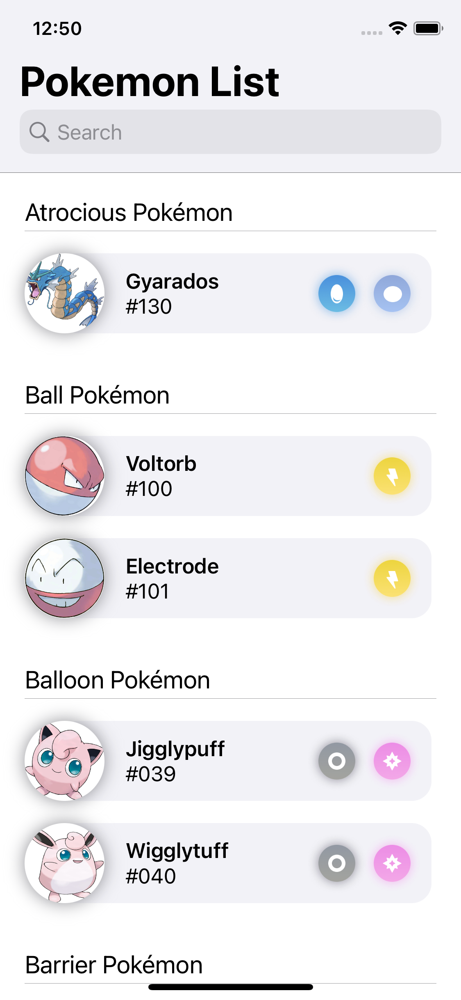
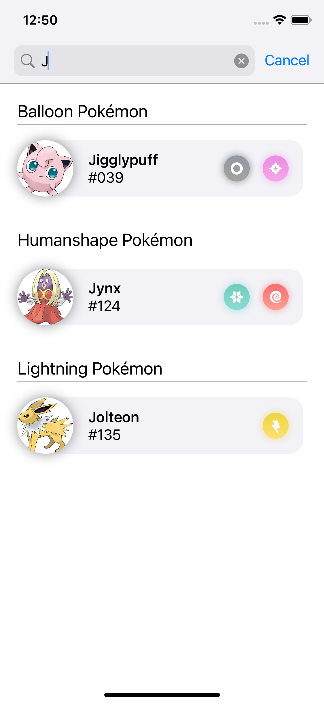
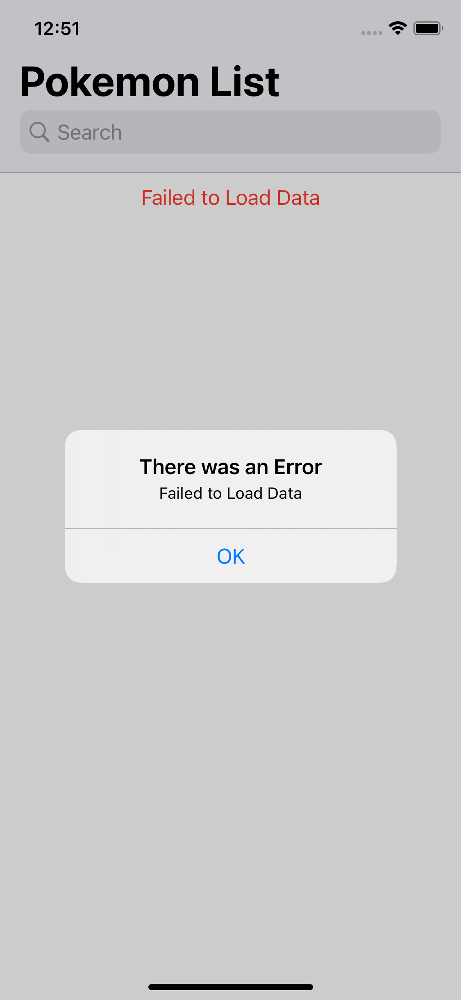
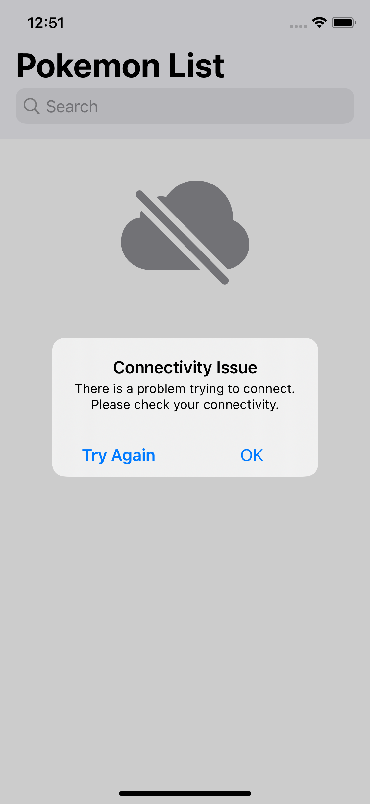
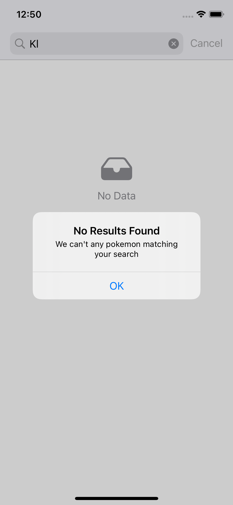

# Ravn-Challenge-V3-NikolLazarte

This project is a mobile app using GraphQL Api

## About the Project

his site was built using [Apollo Client](https://www.apollographql.com/docs/react/), [GraphQL](https://graphql.org) and [Poke Api](https://pokeapi.co/)


## Installation

1. Clone the repo
```
git clone https://github.com/klou17/Ravn-Challenge-V2-NikolLazarteD
```
2. You need to have [npm](https://www.npmjs.com) installed.
```
npm install @apollo/client graphql
```

## Web application

1. When the web application loads, the initial screen will look like this


2. Search data


3. When the web application has an error is displayed like this



